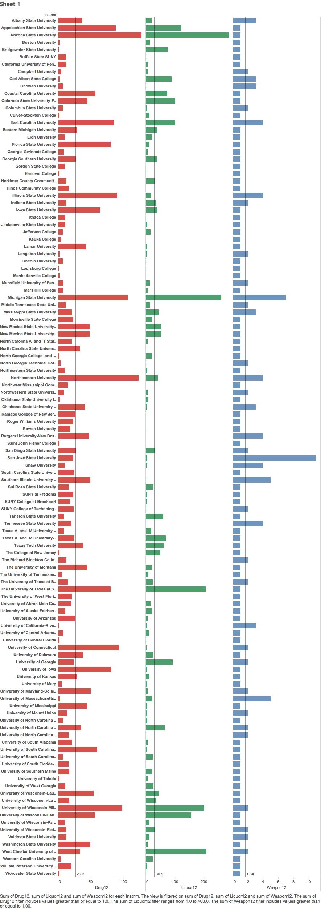
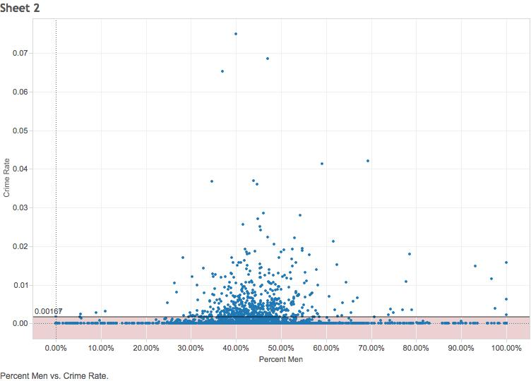
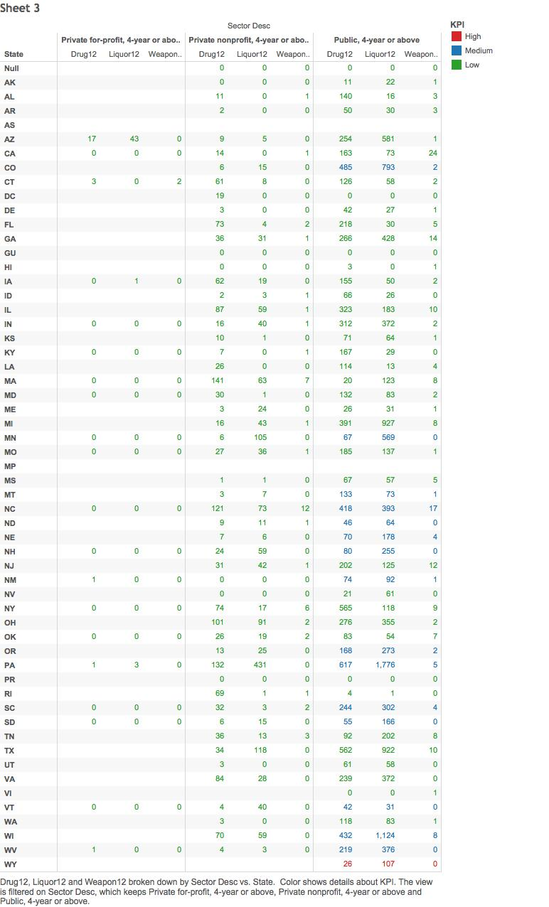

  
  ##Mohammad Chauhan & Patricia O'Brien
  

Here we can see a bar chart that plots the institutions and the number of crime incidents, grouped by type, in the year 2012. The number of weapons crimes were usually lower than the number of drug crimes and liquor crimes. San Jose University had an unusually high number of weapons crimes in 2012. Universities that did not have any weapon, liquor, and drug crimes were not included in this graph. We  added in a reference line for average number of incidents for each type of crime. 

In this graph we made a scatterplot of the percentage of males and the crime rate. We made a caclulated field for each as follows: percentage of males = number of males/ total number of students; crime rate = [sum(liquor)+sum(weapons)+sum
(drugs)]/ total number of students. The highest crime rate was at 0.075. Since our data included schools that don't have residence halls, most of the schools had zero crime incidents of the three types. There was not an obvious trend in the two variables because most universities have an even gender percentage. However, if we look at the two ends of the graph, where the percentage of males is less than 20% and above 80%, the crime rates are higher in the schools that have a 80% or more males compared to the schools that have 20% or less males. 

For the crosstab plot with a KPI and parameters, we decided to analyze the data for 4 year universities. We included private nonprofit, private for profit, and public 4 year or above universities. For the KPI we divided the data up by crime rate. We calculated the crime rate for our scatter plot. The crime rate varied for the states, so we separated them into high (above .01), medium (between 0.0018 an 0.01), and low crime rate (0.0018 and below). In the crosstab, the high crime rate states are red, the medium crime rate states are blue, and the low crime rate states are green. The data in the graph is the number amount for each type of offense that particular type of university had in 2012.
